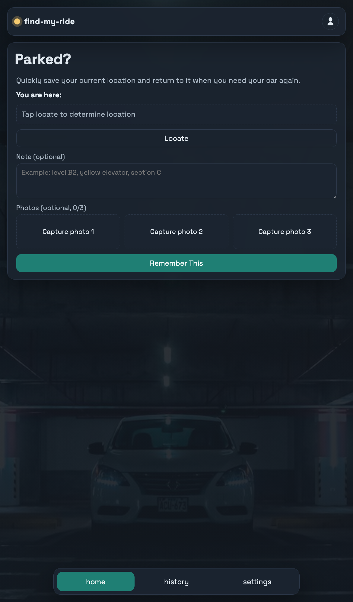
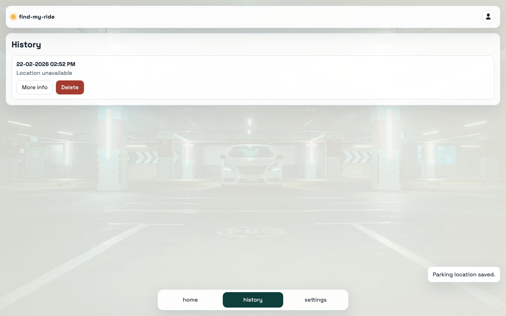
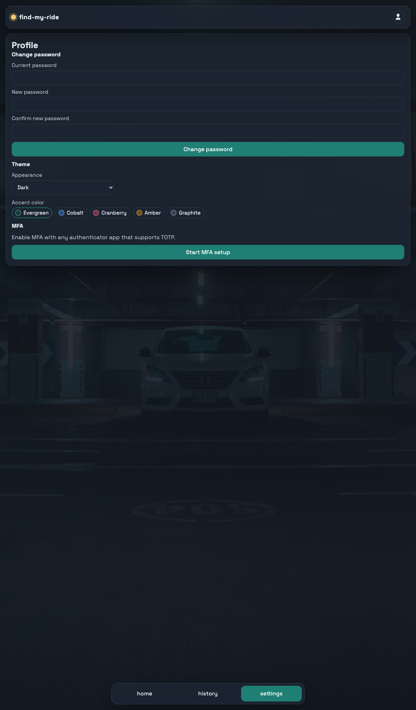

# find-my-ride

`find-my-ride` is a self-hosted, multi-user PWA that helps you remember exactly where you parked.

Use it in a parking garage, city lot, or unfamiliar area: start a parking session, save location/note/photos, and later open history to get back to your car quickly.

Documentation entrypoint: [docs/index.md](docs/index.md)  
Generated (MKdocs) documentation: [https://niels-emmer.github.io/find-my-ride/](https://niels-emmer.github.io/find-my-ride/)

## Screenshots (Mobile)

<p align="center">
  
  
  
</p>

## What The App Does

- Start parking with one tap from `home` (`Parked?`)
- Save evidence while parking:
  - GPS location + resolved physical address (when available)
  - Optional note
  - Optional up to 3 photos
- If GPS is unavailable (for example underground), parking can still start with note/photos
- Active parking becomes a sticky `You are parked` state until manually ended
- Ending parking asks for confirmation and then writes the session to history
- While parking is active, service-worker notifications can show `You are parked here` with elapsed time plus `Take me there` and `Stop parking` actions
- History supports expandable details, map preview, photos, notes, and walking links
- Settings includes an `Info` card with repository link and build version
- Multi-user with role-based access:
  - users can only access their own data
  - admin can manage users and view all records
- Security features include password policy, optional MFA (TOTP), rotating refresh tokens, and API-side validation

## AI Authorship

This project was created entirely by **GPT-5.3-Codex**, with human input limited to orchestration and prompting.

Care has been taken to make the system reasonably secure for practical self-hosted use, but you should still treat it as software you must validate in your own environment before exposing publicly.

Read: `SECURITY.md`

## Security At A Glance

- Authentication:
  - bootstrap admin, self-registration, login
  - optional MFA with authenticator apps
  - short-lived JWT access tokens + rotating HttpOnly refresh cookies
- Authorization:
  - per-user data isolation
  - admin-only user management and global history scope
- Input and content controls:
  - username normalization/validation
  - password policy checks
  - note/location sanitization
  - upload MIME/size/count limits
- Deployment expectations:
  - run behind HTTPS reverse proxy
  - use unique strong secrets per install
  - restrict CORS to your real frontend origin(s)

For hardening checklist and reporting process, see `SECURITY.md`.

## High-Level Architecture

```text
Browser / PWA
   |
   v
Frontend (React + Vite + Nginx)
   |
   v
Backend API (FastAPI)
   |
   +--> PostgreSQL (records, users, tokens)
   +--> File storage volume (uploaded photos)
```

Tech stack:

- Frontend: React, TypeScript, Vite, service worker PWA
- Backend: FastAPI, SQLAlchemy, Pydantic
- Database: PostgreSQL
- Packaging/runtime: Docker + Docker Compose
- Docs: Markdown + MkDocs

## Repository Guide

- `frontend/` — web app (tabs: home, history, settings)
- `backend/` — API, auth, business logic, persistence
- `docs/` — project memory and technical docs
- `docker-compose.yml` — local development stack
- `docker-compose.prod.yml` — production-style stack (for SSL proxy setups)
- `SECURITY.md` — security policy and hardening guidance
- `AGENTS.md` — conventions for coding agents in this repository

## Quick Start (Local Docker)

1. Copy environment template:

```bash
cp .env.example .env
```

2. Set at least:

- `POSTGRES_PASSWORD`
- `SECRET_KEY`

3. Start local stack:

```bash
docker compose up --build
```

or:

```bash
make up
```

4. Open:

- Frontend: `http://localhost:5173`
- Backend docs: `http://localhost:8000/docs`

Phone testing on local network:

- open `http://<your-lan-ip>:<FRONTEND_PORT>`
- note: mobile geolocation usually requires HTTPS; if GPS fails, note/photo fallback still works

## Validation Commands

- Backend tests: `make test`
- Frontend tests: `make test-frontend`
- Full suite: `make test-all`
- Dependency scan: `make security-scan`

## Deploy / Fork Notes

- Use `docker-compose.prod.yml` for VPS deployment.
- Place app behind an SSL reverse proxy (for example Nginx Proxy Manager).
- `FRONTEND_PORT` controls host port mapping in production compose.
- For predictable PWA updates, set:
  - `APP_VERSION` (release/tag string)
- Production cookie/security defaults should include:
  - `REFRESH_TOKEN_COOKIE_SECURE=true`
  - strict `CORS_ORIGINS`

## Documentation System

If you want to extend or fork this project, start here:

- `docs/index.md` — project memory entrypoint
- `docs/architecture.md` — runtime and component architecture
- `docs/dev-guide.md` — local workflow and operations
- `docs/api-reference.md` — endpoint reference
- `docs/decisions.md` — ADR log
- `docs/security.md` — technical security notes

Local docs server:

```bash
pip install -r docs/requirements.txt
mkdocs serve
```

Then open `http://127.0.0.1:8001`.
